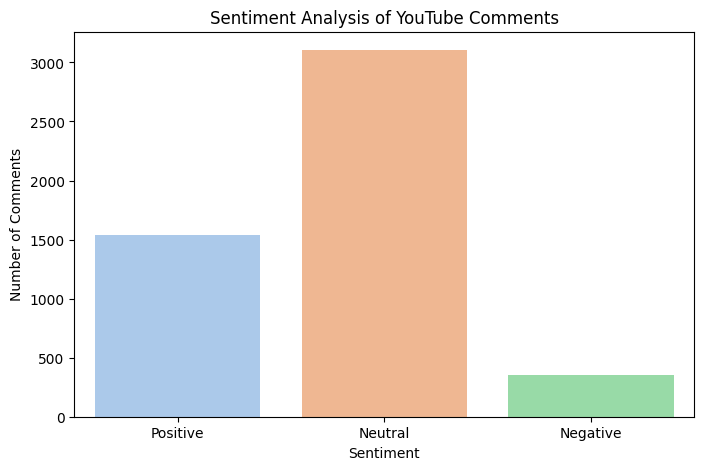
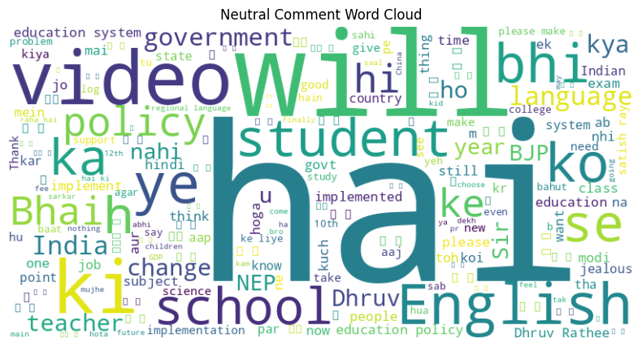

# YouTube Comment Sentiment Analysis (Hinglish-Aware)

This project performs sentiment analysis on YouTube comments related to public policies using multilingual deep learning models. It uses **XLM-Roberta** from Hugging Face Transformers to classify sentiments as Positive, Neutral, or Negative — capable of handling Hinglish (Hindi + English) text.

## 🔍 Use Case
Analyzing public sentiment on **India's National Education Policy 2020 (NEP 2020)** using real YouTube comments from this video:  
[Watch Video](https://www.youtube.com/watch?v=8tiQuiCdbkM)

---

## 📂 Project Structure

- `colab_notebook.ipynb` – End-to-end workflow (comment extraction to sentiment analysis)
- `requirements.txt` – List of dependencies
- `youtube_sentiment_xlmroberta.csv` – Output CSV with comments and sentiment labels

---

## 🧠 What This Project Does

- Fetches comments from a YouTube video using the **YouTube Data API v3**
- Applies sentiment analysis using a **transformer-based multilingual model**
- Visualizes sentiment distribution with **bar and pie charts**
- Saves the final results as a **CSV file**

---

## 🛠 Tech Stack

- **Python**
- **Transformers (XLM-Roberta)**
- **Google YouTube Data API**
- **Pandas, Matplotlib, Seaborn**
- **TextBlob, TQDM**

---

## 📊 Sample Output

  


---

## 📦 Installation

```bash
pip install -r requirements.txt
